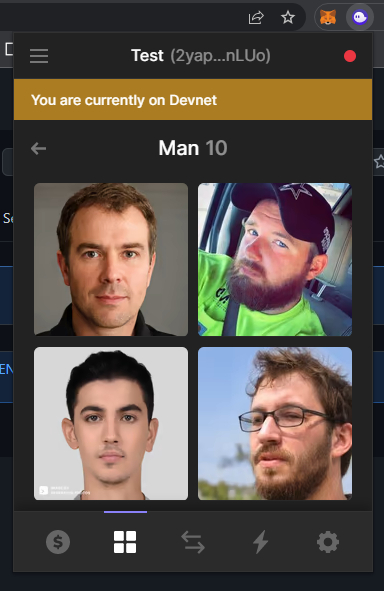

# Candy Machine V2 NFT

## Preview



## Install Sugar CLI

1. Download the Winstaller executable from [here](https://github.com/metaplex-foundation/winstaller/releases/latest/download/winstaller.exe).
2. Try to run the binary by double-clicking on it. If you get a pop-up message warning about an untrusted binary try clicking `More Info` and then `Run Anyway`. If you do not have this option, follow steps 3 - 6.
3. Right-click on the executable file and go to `Properties`.
4. If you trust the Metaplex developer team, check the `Unblock` button as show in the image below. This will allow you to run this binary on your computer since Microsoft does not trust it automatically.
5. Click `Apply` and `Ok`.
6. Double-click the executable file, and it will open a terminal and begin to install Sugar.
7. If everything completed successfully you will get a message saying `Sugar successfully Installed!`.
8. Try running `sugar` in your terminal and see if it prints a list of commands you can use. If so you're good to go!
9. Report any errors to the `#sugar` channel on the Metaplex [Discord](https://discord.gg/metaplex).

## Preparing your Assets

The Candy Machine is a distribution program and in order to use it to mint NFTs, it needs to be loaded up with your project's artwork and metadata.

Your assets consist of a collection of images (e.g., `.png`) and metadata (`.json`) files organized in a 1:1 mapping - i.e., each image has a corresponding metadata file.

There are a multitude of unique ways to generate images and metadata, and in most scenarios, you will automate this process. A good example of an image generation tool is [HashLips](https://github.com/HashLips/hashlips_art_engine). In this guide we will cover the creation of a simple collection to illustrate the metadata requirements and Candy Machine distribution. You should familiarize yourself with the [Token Metadata Standard](https://docs.metaplex.com/programs/token-metadata/token-standard).

## Quick Start

Set up your Solana CLI config with an RPC url and a keypair:

```
solana config set --url <rpc url> --keypair <path to keypair file>
```

Start sugar
```
sugar launch
```

For more docs, Please read [Sugar Docs](https://docs.metaplex.com/tools/sugar/).